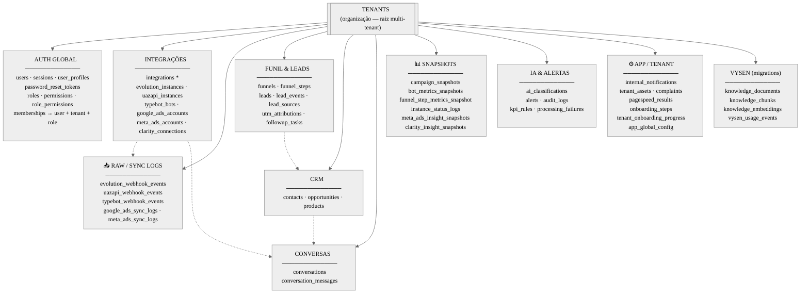
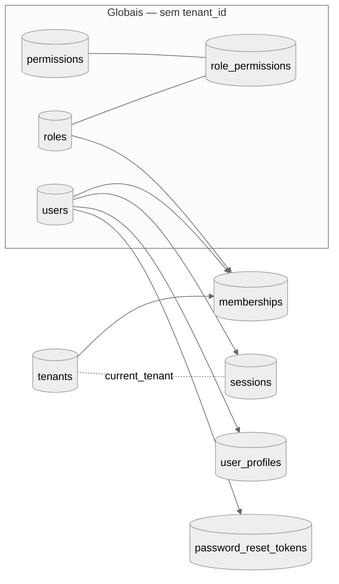
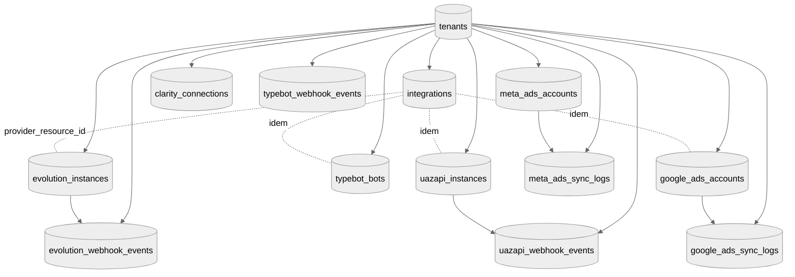
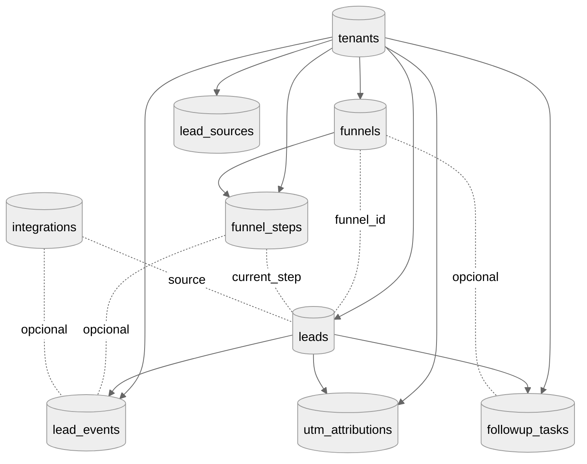
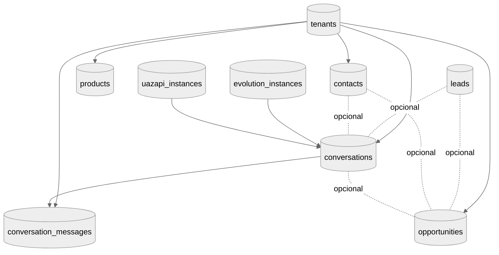
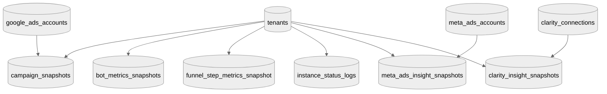
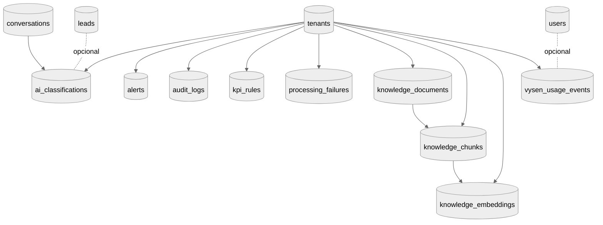

# Diagrama do banco — visual para print

**Versão HTML (navegador):** abra [`estrutura-banco.html`](estrutura-banco.html) no Chrome/Edge — mapa + lista completa em uma página.

Abra este arquivo em **preview Markdown** (Cursor/VS Code ou GitHub) em **tela cheia** (`Ctrl+K` `V` ou preview ao lado). Cada seção abaixo cabe bem em **um print** (zoom 100–125% se precisar).

---

## 1. Visão geral — um print só (domínios)

**Integrations:** `provider_resource_id` aponta para a linha do provedor (sem FK polimórfica no Postgres).

**Vysen:** tabelas nas migrations `0014`–`0015` (pgvector em `knowledge_embeddings`).

---

## 2. Auth e acesso (print separado)

---

## 3. Integrações → eventos brutos (print separado)

---

## 4. Funil, leads e tarefas (print separado)

---

## 5. Contatos, conversas e oportunidades (print separado)

---

## 6. Snapshots e métricas (print separado)

---

## 7. IA, alertas e Vysen (print separado)

---

## Dica de print

1. Preview Markdown **sem sidebar** (janela maximizada).
2. **Um diagrama por captura** — evita letra minúscula no papel.
3. No navegador (GitHub): zoom **110%** se o renderizador Mermaid comprimir.

Fonte dos nomes: `src/db/schema/` + migrations `0014`, `0015`, `0016`, `0018`.
